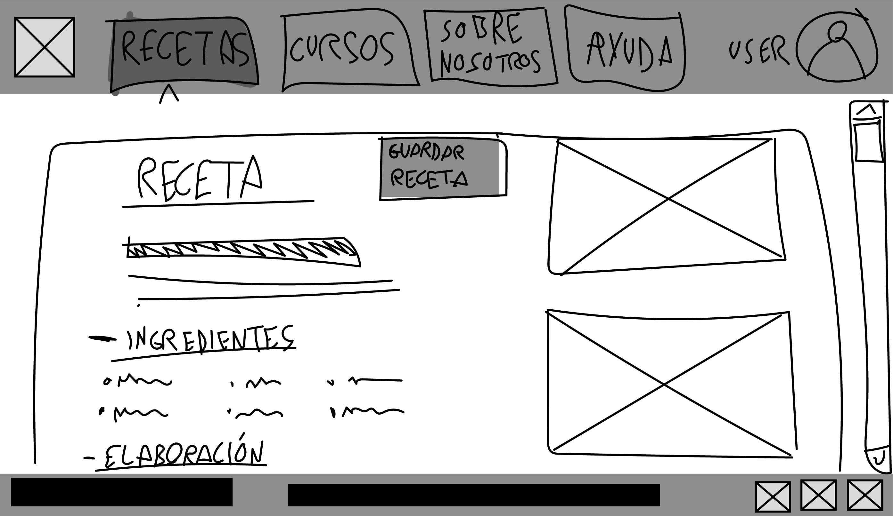

## DIU - Practica2, entregables

### Ideación 

Vamos a sintetizar los hallazgos (insights) y propuesta de diseño usando un mapa de empatía.Recabamos el comportamiento de los usuarios de la práctica 1 (y de nuestra experiencia) para así abordar el diseño.

* Mapa de empatía

(Ver mejor el PDF para leer las notas)

### PROPUESTA DE VALOR
***Con nuestra plataforma de cursos de cocina en línea descrubirás una nueva forma de acceder a recetas exclusivas.
Tendrás la posibilidad de dominar nuevas habilidades culinarias y aprender de los mejores chefs de toda España, y
todo desde el confort de tu hogar. Únete ahora y comienza a crear platos extraordinarios.***

* Scope Canvas
Complementamos con un LeanUX Canvas nuestra propuesta de valor:

### TASK ANALYSIS

* User Task Matrix 
Matriz con todos los casos de uso de la plataforma junto a los actores:

(Ordenado por caso de uso más usado)

* User/Task flow

### ARQUITECTURA DE INFORMACIÓN

* Sitemap

* Labelling 

### Prototipo Lo-FI Wireframe 
Se han realizado un par de bocetos a mano y otros mediante Figma para aplicar Wireframe.
* Bocetos:

CONSULTAR TAMBIÉN EL PDF DE WIREFRAMES

### Conclusiones  
A través de herramientas como el mapa de empatía, hemos profundizado en las necesidades, deseos y puntos de dolor de nuestros usuarios potenciales. Esto nos ha permitido diseñar una propuesta de valor más sólida y centrada en sus necesidades reales.
Al realizar un análisis de tareas y crear una arquitectura de información coherente, hemos logrado definir claramente las funciones principales de la plataforma y organizar su navegación de manera lógica. Esto asegura una experiencia de usuario más intuitiva y fluida.
