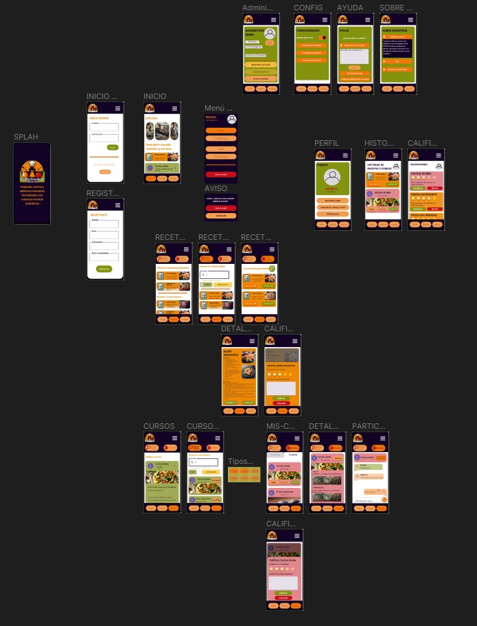

# DIU - Practica 3, entregables

## Moodboard (diseño visual + logotipo)   

Hemos diseñado el moodboard para establecer los colores y estilos para nuestra aplicación. La paleta de colores es split-complementary (rojo, morado oscuro, verde y naranja) que evocan diferentes sensaciones. 

Hacemos uso de tipografías sencillas y elegantes como "Anybody" y "Crimson Text", lo que da una sensación de elegancia y sofisticación. El eslogan destaca la autenticidad y calidad de los productos que ofrece nuestra aplicación.

También hemos incluido los iconos e imágenes específicas para recetas, cursos y comunidad que usaremos a lo largo del diseño de los layouts.

## Landing Page

El Landing Page es la primera toma de contacto del usuario con nuestra plataforma, por lo que debemos hacerla lo más atractiva posible para llamar y retener su atención y convencerlo de descargarsela.

Queremos captar al usuario con nuestro eslogan para que siga en la plataforma, y conozca la funcionalidades que ofrecemos, haciendo uso de los componentes definidos en el Moodboard.

## Guidelines

La información de los patrones de diseño la hemos obtenido de [UI Pattern](https://ui-patterns.com). 

+ Navegación y Contenido
  - NavBar: Proporciona una navegación clara y accesible en todos los dispositivos.
  - Carrusel+Hero Image: Destaca visualmente las recetas para atraer la atención de los usuarios.
  - Search: En la busqueda de recetas, permite a los usuarios encontrar rápidamente
    aquellas recetas según sus preferencias.
  - Article List 5-7 Cards Items: Para el listado de recetas, muestra visualmente una variedad de
    recetas por descubrir.

+ Interacción y Acciones de Usuario
  - Wizards: En el registro de usuarios, guía a los usuarios a través del proceso de registro y lo
    familiariza con la plataforma, lo que mejora la retención y satisfacción del usuario.
  - Item details+actions: En la página de detalles de receta, proporciona detalles y permite a los
    usuarios tomar acciones, como guardarlas.
  - Reserva: Para reservar cursos, facilita la reserva a los usuarios.
  - Event Calendar: Permite  a los usuarios visualizar eventos como los próximos cursos disponibles
    o cuando se ha reservado un curso, en un calendario. Los usuarios interactúan con el calendario
    para visualizar detalles de los cursos, registrar su asistencia o reservar.

+ Comunicación y Retroalimentación
  - Form Input: Permite a los usuarios enviar comentarios de manera sencilla y rápida.
  - About: En la pagina "Acerca de nosotros". Proporciona información relevante sobre la empresa
    y su equipo, dando una imagen de trnasparencia para aumentar la confianza de los usuarios.

## Mockup: LAYOUT HI-FI

Hemos desarrollado el diseño High-Fidelity de nuestra aplicación tras un proceso de investigación y diseño realizado a lo largo de la asignatura.

La aplicación comienza con un "splash screen" o pantalla de bienvenida, y acto seguido pasa a un formulario donde el usuario debe registrarse o iniciar sesión.

La primera sección presentada es el inicio, donde se muestran los últimos cursos y recetas publicados. Tiene un menú de navegación en la parte inferior con el que se podrá cambiar entre las principales secciones.

En este [link](https://www.figma.com/proto/mN3goO6CiMiPbof7fDYymf/Wireframes?node-id=72-30&t=Qh9vmQpLcjog7CdG-1&scaling=min-zoom&page-id=63%3A2&starting-point-node-id=82%3A129) se puede ver el Prototype en acción.

## Documentación: Publicación del Case Study

En el Case Study presentamos una visión detallada del desarrollo y diseño de nuestra aplicación de una forma que las personas que no están relacionadas con este tipo de prácticas lo entienda.

A continuación, puede visualizar el [Case Study](../README.md) que hemos llevado a cabo.

### Valoraciones del equipo sobre la realización de la práctica

En la realización de Moodboard decidimos simplificar el logotipo y crear una versión horizontal para una mejor adaptación en pantallas o cabeceras. Comprobamos en la página [logolab](https://logolab.app/home) que el logotipo funcione en varias pruebas como, por ejemplo, para diferentes tamaños.

Para el Landing Page hemos reutilizado las estructuras de los Wireframes de la P2, pero para un formato 4:3 o similar. Los tamaños de los textos podrían adecuarse según el formato o tamaño de la pantalla.

En cuanto a los layouts, hemos podido completar la mayoría de las páginas, aunque no es del todo funcional. La funcionalidad del scrolling era compleja de implementar, por lo que lo compensamos con más layouts. No completamos la funcionalidad de todos los botones ya que disponíamos de demasiados layouts, lo que hacía inviable crear una animación para cada botón.

Esta práctica nos ha resultado bastante útil, consiguiendo competencias suficientes para el diseño de futuras aplicaciones.

 
