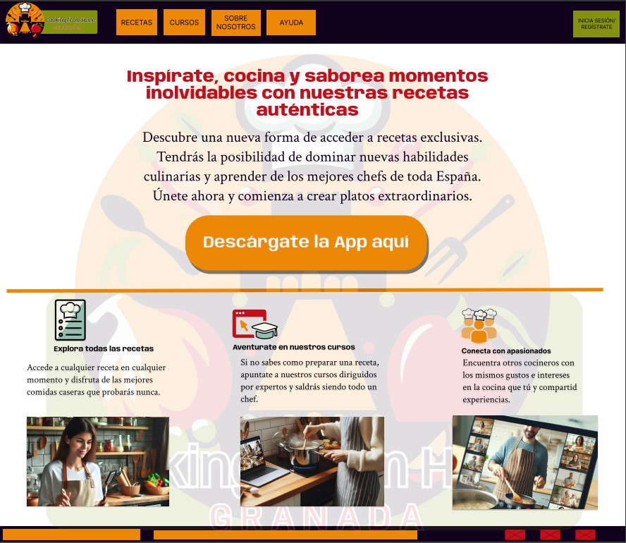

# DIU - Practica 3, entregables

## Moodboard (diseño visual + logotipo)   

## Landing Page

## Guidelines

La información de los patrones de diseño la hemos obtenido de [UI Pattern](https://ui-patterns.com). 

+ Navegación y Contenido
  - NavBar: Proporciona una navegación clara y accesible en todos los dispositivos.
  - Carrusel+Hero Image: Destaca visualmente las recetas para atraer la atención de los usuarios.
  - Search: En la busqueda de recetas, permite a los usuarios encontrar rápidamente
    aquellas recetas según sus preferencias.
  - Article List 5-7 Cards Items: Para el listado de recetas, muestra visualmente una variedad de
    recetas por descubrir.

+ Interacción y Acciones de Usuario
  - Wizards: En el registro de usuarios, guía a los usuarios a través del proceso de registro y lo
    familiariza con la plataforma, lo que mejora la retención y satisfacción del usuario.
  - Item details+actions: En la página de detalles de receta, proporciona detalles y permite a los
    usuarios tomar acciones, como guardarlas.
  - Reserva: Para reservar cursos, facilita la reserva a los usuarios.
  - Event Calendar: Permite  a los usuarios visualizar eventos como los próximos cursos disponibles
    o cuando se ha reservado un curso, en un calendario. Los usuarios interactúan con el calendario
    para visualizar detalles de los cursos, registrar su asistencia o reservar.

+ Comunicación y Retroalimentación
  - Form Input: Permite a los usuarios enviar comentarios de manera sencilla y rápida.
  - About: En la pagina "Acerca de nosotros". Proporciona información relevante sobre la empresa
    y su equipo, dando una imagen de trnasparencia para aumentar la confianza de los usuarios.

## Mockup: LAYOUT HI-FI
En este link se puede ver el Prototype en acción: [LINK](https://www.figma.com/proto/mN3goO6CiMiPbof7fDYymf/Wireframes?node-id=72-30&t=Qh9vmQpLcjog7CdG-1&scaling=min-zoom&page-id=63%3A2&starting-point-node-id=82%3A129)

## Documentación: Publicación del Case Study

(incluye) Valoración del equipo sobre la realización de esta práctica o los problemas surgidos
 
