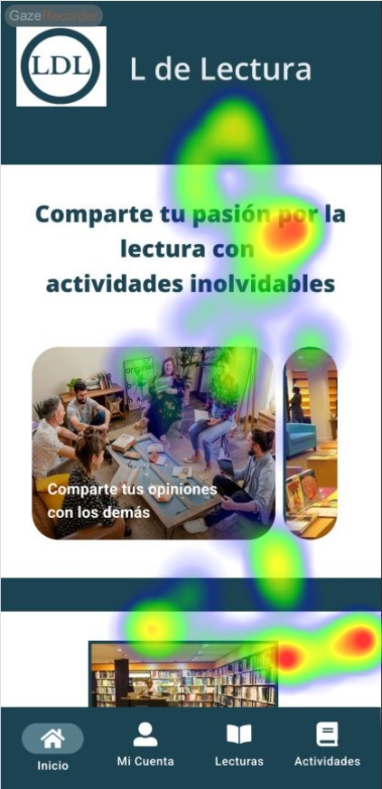
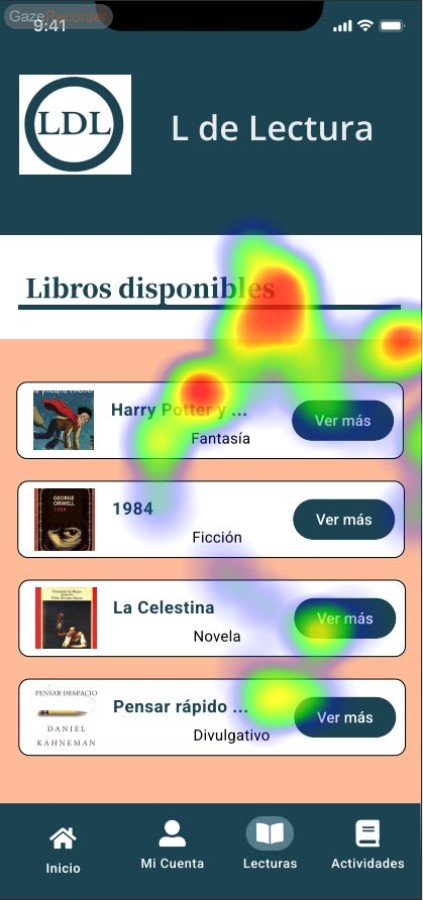
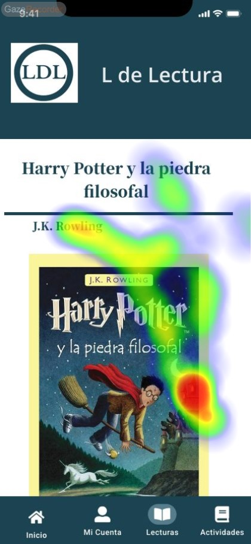
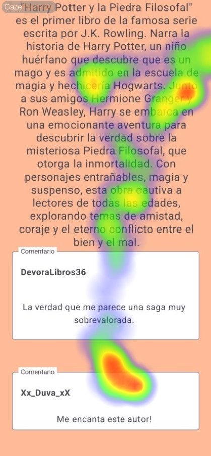

# Usability Report

# L de Lectura

### 28/05/2024

[L de Lectura](./logo.png)

[Enlace a GITHUB del proyecto](https://github.com/Duva-01/DIU.DTR)

## 0 Realizado por el Equipo Pizza_con_Pionono

* Adrián Romero Vílchez
* Álvaro Ruiz Luzón

Hemos realizado este informe a modo de evaluación del proyecto "L de Lectura". Nuestra experiencia cubre aspectos de diseño de aplicaciones móvil, incluyendo la elaboración de interfaces de usuario intuitivas.

## 1 DESCRIPCIÓN DEL WEBSITE

Se trata de una aplicación móvil creada con el principal objetivo de entretener y divertir mediante la lectura de libros y reuniones de debate.

Para ello, han creado un apartado donde puedes ver una breve descripción del libro, para atraer la atención de los lectores. También tiene un apartado con comentarios de los usuarios. 
Disponen de otro apartado de actividades que tiene un breve resumen sobre lo que se hizo en la última reunión.

## 2 RESUMEN EJECUTIVO

Al comienzo, la interfaz de usuario es sencilla, lo que ayuda a la legibilidad del texto, algo que es coherente con una aplicación de lectura. La paleta de colores se compone de un azul frío, lo que ayuda a relajar la vista y facilitar la lectura de los libros.

Sin embargo, presenta un gran problema cuando se realiza el scroll en cada página, y es que la barra de navegación (Home, Lecturas, Actividades) permanece estática en mitad (un poco por debajo) de la pantalla, en lugar de quedarse bloqueada en la parte baja, algo que resulta realmente frustante para la navegacióny la lectura en la aplicación.

## 3 METODOLOGIA 

### Metodología de usabililidad

Hemos seleccionado a varias personas de nuestro entorno para la realización de los tests, para darle un enfoque los más objetivo posible, sin que nuestros conocimientos influyan en las decisiones tomadas por los usuarios que realizan los tests.

Hemos realizado un estudio de eyetracking donde hemos instruido a los usuarios sobre el uso de este software para comprobar cuáles son las zonas AOI de cada página, a la vez que podremos identificar los puntos más débiles y que deberían resaltar más.

### Test de usuarios: Participantes

| Usuario | Sexo      | Edad | Ocupación  | Experiencia en internet | Plataforma       | Perfil cubierto                                                                                                                                                        | Test | SUS  |
| ------- | --------- | ---- | ---------- | ----------------------- | ---------------- | ---------------------------------------------------------------------------------------------------------------------------------------------------------------------- | ---- | ---- |
| Jaime     | Hombre  | 21   | Estudiante | Alta                    | Linux   | Joven estudiante apasionado por la lectura y los debates. Quiere encontrar un grupo con el que compartir ideas sobre sus libros favoritos.   | B    | 70   |
| Esteban  | Hombre | 27   | Abogado   | Media                    | Movil          | Abogado joven que busca una forma de desestresarse después de un duro día de trabajo. La plataforma es un poco confusa debido a que no puede ver de forma correcta su contenido. | B    | 63   |

### Eyetracking

- **Tarea B: Consultar información de un libro de Harry Potter**:

Inicio de la App

Sección de Lecturas

Detalles del libro

Descripción y comentarios

#### Resultados del Eye Tracking de la tarea B:

En el inicio detectamos AOI (Areas Of Interest) tanto en el título de la sección como en los iconos de navegación de abajo (en el heatmap hay un poco de imprecisión). El uso de imágenes captan más o menos la atención del usuario.

En la sección de ***Lecturas*** tenemos varios AOI en el título y en los primeros cards de libros.

En la portada del libro captamos un AOI en su derecha, dando la impresión de buscar algo abajo a la derecha para más información o seguir navegando.

Cuando scrolleamos para leer la descripción y comentarios se consigue captar la atención, ya que se muestran varios AOI leves en la descripción y uno fuerte en los labels de comentarios.

### Resultados obtenidos de los cuestionarios SUS

Con los resultados obtenidos de los cuestionarios SUS, podemos observar que hay un gran acercamiento entre los datos obtenidos en los cuestionarios SUS, siendo el SUS score un OK, de acuerdo a la escala Adjetiva.

* Consulte de forma más detallada los [Cuestionarios SUS](./SUS_Cuestionaries.jpg)

## 4 CONCLUSIONES 

* La barra de navegación es un problema de usabilidad a la hora de hacer uso de la aplicación, limitando la visibilidad y navegación de los usuarios. Esto genera a los usuarios cierta confusión mientras se dedican a la lectura de los libros.  
Una forma de mejorarlo sería manteniendo la barra de navegación en la parte inferior de la pantalla.

* No hay una forma cómoda para volver hacia la última pestaña en la que nos encontrábamos. Por ejemplo, si entramos en el apartado de lecturas y clicamos en un libro, no podemos volver al apartado de lecturas, sino que debemos ir al Home y pinchar en Lecturas de nuevo.  
La solución es bastante sencilla, y sería hacer que el mismo botón de Lecturas navegara hacia la última pestaña.

* A pesar del problema de la barra de navegación, el scroll está bien implementado y da una sensación de aplicación móvil bastante buena.

#### Valoración de la prueba de usabilidad (self-assesment)

La prueba de usabilidad ha sido útil para identificar algunos fallos en la aplicación "L de Lectura". A través de los cuestionarios SUS y del estudio de eyetracking hemos obtenido una visión clara y objetiva de cómo interactúan los usuarios con la aplicación y cuáles son sus dificultades.

Gracias a la diversidad de los participantes hemos podido obtener una perspectiva amplia y diversa sobre los problemas de usabilidad.

Los cuestionarios SUS y el eyetracking nos ha proporcionado un feedback específico sobre áreas clave de la aplicación que requieren mejoras.

Como conclusión, las pruebas han sido muy beneficiosas y las técnicas empleadas han demostrado su eficacia y han proporcionado insights valiosos para guiar futuras mejoras y asegurar una experiencia de usuario óptima.
