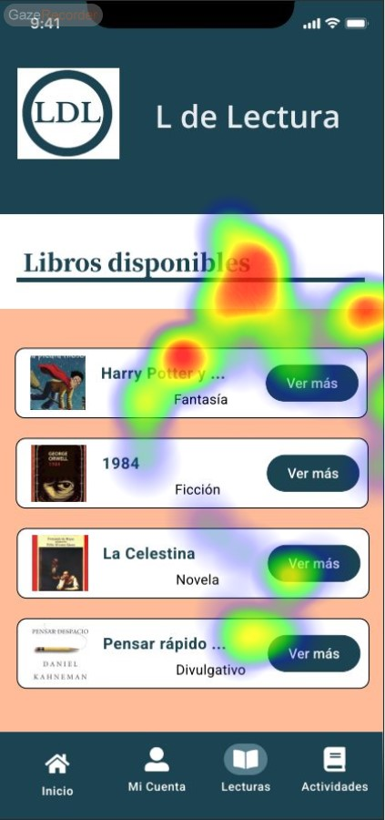
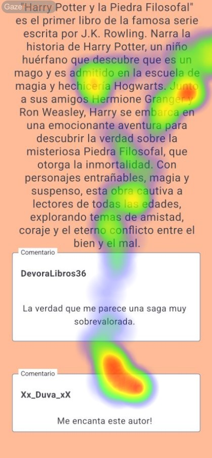

# DIU - Practica 4, entregables

Revisar [Asignacion_ABtesting](https://github.com/mgea/DIU/blob/master/P4/Asignacion_ABtesting.pdf)
Lista de grupos 

## Asignación del caso B
Se nos ha asignado el grupo **DIU3.DTR**. Link del GitHub: https://github.com/Duva-01/DIU.DTR

* Users 

Elección y características

## A/B Testing
### Eye Tracking 
Este estudio de eye tracking se llevó a cabo para analizar el comportamiento visual de los usuarios mientras realizan dos tareas diferentes en dos plataformas distintas. Las tareas son:

1. Tarea A: Acceder a un curso de Cocina árabe y participar en el chat en la plataforma de recetas y cursos.

2. Tarea B: Consultar la información de un libro de Harry Potter en la plataforma de clubes de lectura.

Los objetivos de este estudio son:
* Identificar áreas de interés (AOI) en las interfaces de usuario.
* Analizar patrones de fijación y movimientos oculares.
* Evaluar la usabilidad de las plataformas en función del comportamiento visual de los usuarios.

Los participantes somos los dos integrantes del grupo que, mediante el uso de la herramienta ***Gaze Recorder*** y 30 segundos de test hemos realizado las tareas.

- **Tarea A: Participar en un curso de Cocina**:

 Inicio de la App

 Sección de cursos

 Mis cursos

 Detalles del curso

 Participando en el curso mediante chat

#### Resultados del Eye Tracking de la tarea A:

Hemos detectado que en el inicio tenemos un AOI en el **carrusel** y otro también en el card de descubrir **nuevas recetas y cursos**, por lo que el uso de widgets con imágenes como el carrusel son áreas clave como captura de atención.

En la sección de cursos hemos detectado un pequeño AOI en la descripción del primer curso en pantalla y en el botón ***Mis cursos*** (podemos añadir que hay un patrón de fijación en los títulos de las secciones).

Estando en ***Mis cursos*** detectamos AOI en las imágenes del card del curso, en las opcones de navegación de arriba y en el borón de inicio de abajo. El patrón sobre las imágenes anterormente mencionado sigue demostrándose.

Cuando accedemos al curso, el botón de ***Participar*** consigue una gran atención del usuario debido al efecto de sobresalir del card (con sombras). Otros AOI son los títulos de las lecciones del curso.

Una vez participando en el curso mediante el chat, los AOI demuestran que el usuario lee desde arriba hasta abajo terminando en la imagen de nuestro texto. El uso de un chat vertical demuestra que el usuario da importancia al orden y de lo que él escribe o tiene como imagen de perfil a la hora de relacionarse con el resto de alumnos del curso.

- **Tarea B: Consultar información de un libro de Harry Potter**:

Inicio de la App

Sección de Lecturas

Detalles del libro

Descripción y comentarios

#### Resultados del Eye Tracking de la tarea B:

En el inicio detectamos AOI tanto en el título de la sección como en los iconos de navegación de abajo (en el heatmap hay un poco de imprecisión). El uso de imágenes captan más o menos la atención del usuario.

En la sección de ***Lecturas*** tenemos varios AOI en el título y en los primeros cards de libros.

En la portada del libro captamos un AOI en su derecha, dando la impresión de buscar algo abajo a la derecha para más información o seguir navegando.

Cuando scrolleamos para leer la descripción y comentarios se consigue captar la atención, ya que se muestran varios AOI leves en la descripción y uno fuerte en los labels de comentarios.

## Usability Report de Caso B
* Template de usability.gob (https://www.usability.gov/how-to-and-tools/resources/templates/report-template-usability-test.html) 

## Conclusiones
