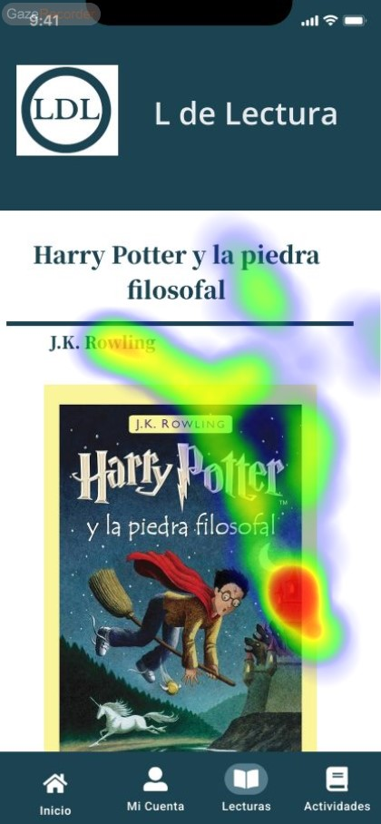

# DIU - Practica 4, entregables

## Asignación del caso B
Se nos ha asignado el grupo **DIU3.DTR**. Link del GitHub: https://github.com/Duva-01/DIU.DTR

## A/B Testing

Vamos a aplicar la metodología de experimentación A/B testing para comparar dos plataformas y saber cuál produce mejores resultados. En este caso vamos a comparar nuestra aplicación (sujeto A) con la del grupo seleccionado (sujeto B).
Este estudio nos será útil como herramienta para la optimización de la conversión y mejora de la experiencia de usuario en nuestra plataforma.

Vamos a llevar a cabo varios pasos:
  1º Seleccionamos a varias personas que actuarán como usuarios para las pruebas que vamos a realizar.
  2º Cada usuario realizará un test SUS; es decir, un cuestionario de varias preguntas sobre la aplicación que previamente habrá probado, y pondrá una puntuación a cada pregunta de 1-5.
  3º Con la puntuación total de los cuestionarios haremos una puntuación del 0-100, y según el rango que esté tendrá una valoración final.
  4º Mientras se realiza los tests SUS, vamos a escoger a dos usuarios para realizarles una prueba de Eye Tracking para localizar áreas de interés y zonas que deben mejorar la captación de atención.

* Users 

Los usuarios elegidos han sido creados mediante la combinación de características de Role Play y usuarios de nuestro entorno.

| Usuarios | Sexo/Edad     | Ocupación   |  Exp.TIC    | Personalidad | Plataforma | TestA/B
| ------------- | -------- | ----------- | ----------- | -----------  | ---------- | ----
| Carmen  | M / 37   | Ama Casa  | Media       | Extrovertido | Móvil       | A 
| Manuel  | H / 67   | Jubilado  | Baja       | Introvertido       | Windows        | A 
| Jaime  | H / 21   | Estudiante     | Alta        | Timido    |Linux      | B 
| Esteban  | H / 27   | Abogado  | Media       | Racional     |Móvil        | B 

### Eye Tracking 
Este estudio de eye tracking se llevó a cabo para analizar el comportamiento visual de los usuarios mientras realizan dos tareas diferentes en dos plataformas distintas.
Los usuarios escogidos para las pruebas son Carmen y Jaime.
- Carmen hará la tarea A.
- Jaime hará la tarea B.

Las tareas son:

1. Tarea A: Acceder a un curso de Cocina árabe y participar en el chat en la plataforma de recetas y cursos.

2. Tarea B: Consultar la información de un libro de Harry Potter en la plataforma de clubes de lectura.

Los objetivos de este estudio son:
* Identificar áreas de interés (AOI) en las interfaces de usuario.
* Analizar patrones de fijación y movimientos oculares.
* Evaluar la usabilidad de las plataformas en función del comportamiento visual de los usuarios.

Los participantes han probado las tareas a evaluar que, mediante el uso de la herramienta ***Gaze Recorder*** y 30 segundos de test hemos realizado las tareas. Vamos a ver dos pruebas:

- **Tarea A: Participar en un curso de Cocina**:

 Inicio de la App

 Sección de cursos

 Mis cursos

 Detalles del curso

 Participando en el curso mediante chat

#### Resultados del Eye Tracking de la tarea A:

Hemos detectado que en el inicio tenemos un AOI en el **carrusel** y otro también en el card de descubrir **nuevas recetas y cursos**, por lo que el uso de widgets con imágenes como el carrusel son áreas clave como captura de atención.

En la sección de cursos hemos detectado un pequeño AOI en la descripción del primer curso en pantalla y en el botón ***Mis cursos*** (podemos añadir que hay un patrón de fijación en los títulos de las secciones).

Estando en ***Mis cursos*** detectamos AOI en las imágenes del card del curso, en las opcones de navegación de arriba y en el borón de inicio de abajo. El patrón sobre las imágenes anterormente mencionado sigue demostrándose.

Cuando accedemos al curso, el botón de ***Participar*** consigue una gran atención del usuario debido al efecto de sobresalir del card (con sombras). Otros AOI son los títulos de las lecciones del curso.

Una vez participando en el curso mediante el chat, los AOI demuestran que el usuario lee desde arriba hasta abajo terminando en la imagen de nuestro texto. El uso de un chat vertical demuestra que el usuario da importancia al orden y de lo que él escribe o tiene como imagen de perfil a la hora de relacionarse con el resto de alumnos del curso.

- **Tarea B: Consultar información de un libro de Harry Potter**:

Inicio de la App

Sección de Lecturas

Detalles del libro

Descripción y comentarios

#### Resultados del Eye Tracking de la tarea B:

En el inicio detectamos AOI tanto en el título de la sección como en los iconos de navegación de abajo (en el heatmap hay un poco de imprecisión). El uso de imágenes captan más o menos la atención del usuario.

En la sección de ***Lecturas*** tenemos varios AOI en el título y en los primeros cards de libros.

En la portada del libro captamos un AOI en su derecha, dando la impresión de buscar algo abajo a la derecha para más información o seguir navegando.

Cuando scrolleamos para leer la descripción y comentarios se consigue captar la atención, ya que se muestran varios AOI leves en la descripción y uno fuerte en los labels de comentarios.

## Test SUS (System Usability Scale)
Esta herramienta nos ayudará a medir la evaluación de las dos plataformas
El cuestionario SUS consta de 10 ítems con opciones de respuesta en una escala de 5 puntos, que van desde "Totalmente en desacuerdo" hasta "Totalmente de acuerdo". Las preguntas están diseñadas para capturar una visión general de la usabilidad del sistema.

## Usability Report de Caso B

El informe de usabilidad para la aplicación "L de Lectura" revela tanto aspectos positivos como áreas de mejora. La aplicación, diseñada para fomentar la lectura y el debate sobre libros, presenta una interfaz de usuario sencilla y una paleta de colores relajante, lo cual favorece la lectura. Sin embargo, un problema significativo es la barra de navegación, que permanece estática en una posición incómoda durante el desplazamiento, dificultando la visibilidad y la navegación de los usuarios.

Los resultados de los tests de usabilidad, que involucraron a usuarios de diferentes perfiles, resaltaron la necesidad de mejorar la intuición y accesibilidad de la plataforma, especialmente para aquellos con menos experiencia en tecnología. Las técnicas utilizadas, como los estudios de eyetracking y los cuestionarios SUS, fueron útiles para identificar estas deficiencias y proponer soluciones, como ajustar la posición de la barra de navegación y simplificar la interfaz, lo cual se espera que mejore significativamente la experiencia del usuario.

## Conclusiones

El estudio de eye tracking realizado revela patrones de comportamiento visual de los usuarios al interactuar con dos tareas diferentes en dos plataformas distintas. Para la tarea A, participar en un curso de cocina, se observó una atención destacada en el carrusel de la página de inicio y en el botón de "Participar" en el chat del curso. En cambio, para la tarea B, consultar información sobre un libro de Harry Potter, se encontró una mayor atención en los títulos de secciones y en la descripción del libro. Estos resultados ofrecen una visión detallada de cómo los usuarios interactúan con la interfaz y qué elementos captan su atención.

El análisis de usabilidad de la aplicación "L de Lectura" reveló tanto puntos favorables como áreas de oportunidad. Mientras que la interfaz simple y la paleta de colores relajante promueven una experiencia de lectura agradable, la barra de navegación estática resulta incómoda al desplazarse, afectando la experiencia del usuario. Los métodos de evaluación, incluyendo el eyetracking y los cuestionarios SUS, fueron efectivos para identificar problemas y proponer soluciones, como ajustar la ubicación de la barra de navegación y simplificar la interfaz, con el fin de mejorar la experiencia general del usuario en la plataforma.
