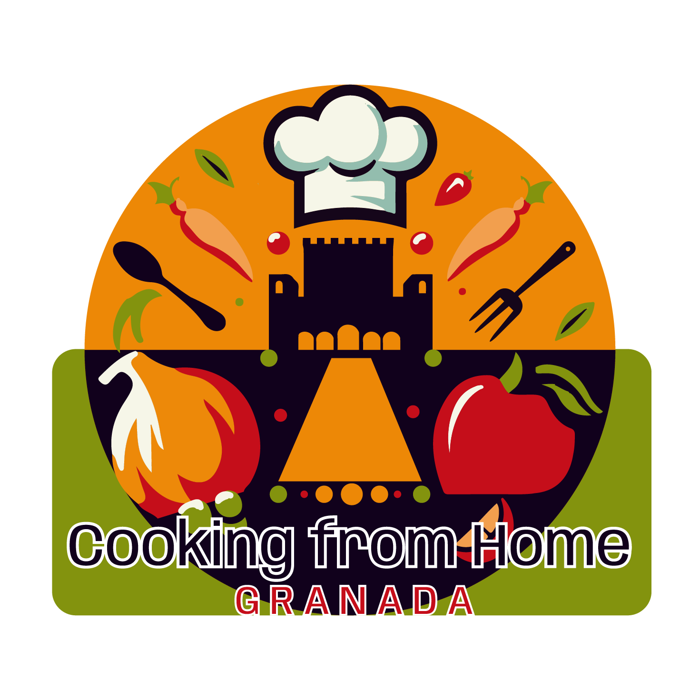
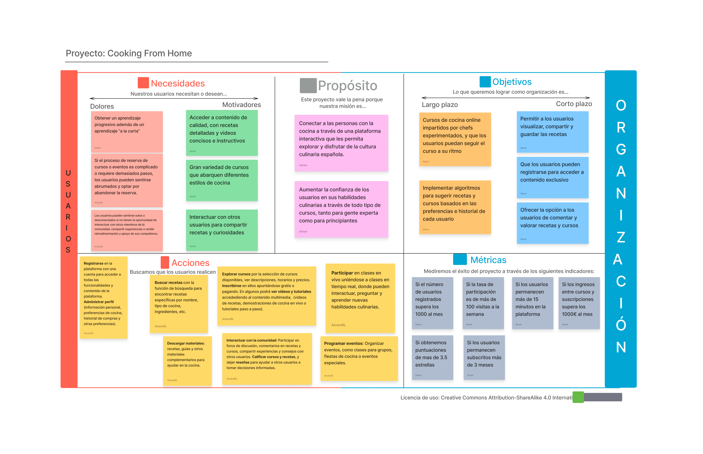

# DIU24
Prácticas Diseño Interfaces de Usuario 2023-24 (Tema: Experiencias gastronómicas) 

### Repositorio GitHub: https://github.com/AlvareitorHD/DIU2.git

Grupo: DIU2_PizzaConPionono.  Curso: 2023/24 
Updated: 24/04/2024

Proyecto: Cooking From Home

Descripción: 
Nuestra plataforma ofrece una experiencia única para todos los entusiastas de la cocina que desean llevar sus habilidades culinarias al siguiente nivel. Con una amplia variedad de cursos de cocina en línea, te invitamos a descubrir una nueva forma de acceder a recetas exclusivas y aprender de los mejores chefs de toda España, todo desde la comodidad de tu hogar.

Propuesta de Valor:
Con nuestra plataforma de cursos de cocina en línea descubrirás una nueva forma de acceder a recetas exclusivas. Tendrás la posibilidad de dominar nuevas habilidades culinarias y aprender de los mejores chefs de toda España, y todo desde el confort de tu hogar. Únete ahora y comienza a crear platos extraordinarios.

Logotipo:

Miembros
 * :bust_in_silhouette:   Álvaro Ruiz Luzón     :octocat:     
 * :bust_in_silhouette:  Adrián Romero Vílchez     :octocat:

----- 

# Proceso de Diseño 

## Paso 1. UX Desk Research & Analisis 

 **1.a User Research Plan**
-----

El proyecto se centra en un centro de formación que ofrece cursos y talleres de cocina para particulares y profesionales del sector de la hostelería. El objetivo de la investigación es adquirir conocimientos para mejorar el diseño y desarrollo de la plataforma en el ámbito de la gastronomía.

Los objetivos del negocio y KPIs incluyen comprender al usuario, evaluar la facilidad de uso de la plataforma, aumentar la participación de los usuarios en actividades gastronómicas y mejorar la diversidad y calidad de las actividades ofrecidas.

Se recopilará información cualitativa y cuantitativa a través de pruebas de usabilidad, entrevistas de experiencia, encuestas de expectativas, datos de uso, encuestas de satisfacción y perfiles de usuarios. Los documentos y artefactos a crear incluyen un informe de investigación, tablas y gráficos, mapas de empatía y storyboards de experiencia del usuario.

Los insights obtenidos de la investigación guiarán decisiones como el desarrollo de características y funcionalidades, la optimización de la experiencia del usuario, la personalización del contenido y la comunicación, la mejora de la calidad y variedad de actividades, y la optimización de estrategias de marketing y comunicación.

Los métodos de investigación incluirán entrevistas con participantes potenciales, estudios etnográficos, pruebas de usabilidad, encuestas de satisfacción y análisis de comentarios de usuarios.

Se estudiarán temas como la utilidad, aprendizaje, eficiencia, memorabilidad, errores, satisfacción y persuasión del diseño de la plataforma. Se enfocará en la claridad, simplicidad, navegabilidad y atractivo visual de la plataforma.

Como stakeholder, se ha tenido experiencia participando en actividades gastronómicas similares, lo que brinda una perspectiva valiosa sobre las necesidades y preferencias de los usuarios. Como diseñador, se cuenta con habilidades para desarrollar un diseño cómodo y atractivo para los usuarios.

Como conclusión, este User Research profundiza en las necesidades y comportamientos de los usuarios en experiencias gastronómicas, ofreciendo insights valiosos para mejorar el diseño, desarrollo y estrategias de marketing de la plataforma. Con un enfoque en la satisfacción del usuario, este estudio es fundamental para el éxito competitivo en el mercado culinario.

[User Research PDF](./P1/User_Research.pdf)

 1.b Competitive Analysis
-----

Hemos seleccionado tres aplicaciones para realizar el Competitive Analysis:

- **Granada Cooking**: Ofrece talleres de cocina en Granada con un precio medio de 50€ por taller. Es simple y fácil de reservar actividades, lo que lo hace adecuado para casi cualquier usuario de Granada.

- **Espai Granada**: Un loft vanguardista ideal para eventos, con un precio medio de 20€ por taller. Aunque es mejorable, ofrece servicios interesantes en un ático y tiene un enfoque más familiar.

- **Summumm**: Proporciona un programa completo para disfrutar individualmente o con empresas, con un precio medio de 85€ por taller. Cuenta con diversificaciones y estrategias de expansión, como cenas y asesoramiento además de los talleres.

Hemos elegido estudiar ***Summumm*** debido a la diversidad de servicios y estrategias de expansión que tienen, pueden atraer tanto a individuos como a empresas, ofreciendo una experiencia más completa y variada. Además, su enfoque profesional puede ajustarse a necesidades complejas, lo que le da una ventaja sobre los otros dos competidores.

[Competitive_Analysis PDF](./P1/Competitor_Analysis.pdf)

 1.c Persona
-----

Hemos seleccionado a estas personas porque representan grupos demográficos variados que nos ofrece perspectivas diversas.

Por un lado, tenemos una visión de una persona poco relacionada con la tecnología y no muy experimentada, María Antoñieta, que nos ayuda
a ver como pueden desenvolverse las personas mayores al usar nuestra plataforma. Maria Antoñieta es una señora mayor que quiere probar
nuevas experiencias y descubrir nuevos platos y sabores.

Por otro lado, tenemos a Li Yong, que tiene mucha más soltura con los ordenadores y el manejo de las tecnologías, lo que nos permite comprobar
si el diseño de nuestra plataforma le resultaría adecuado a gente joven y enérgica.

 1.d User Journey Map
----

Maria Antoñieta se encuentra planeando un viaje a Granada cuando le cuentan de nuestros cursos de cocina y se aventura a 
reservar un curso, sin tener mucha idea de como funciona nuestra plataforma. Li Yong quiere realizar algún curso de 
cocina occidental, pero debido a la dificultad del idioma no puede filtrar bien los talleres que desea realizar.

 1.e Usability Review
----

Proceso de evaluación de la página web Granada Cooking, donde comprobamos diferentes puntos y si debería de mejorarlos. En dicho estudio evaluamos diferentes apartados, como lo son la funcionalidad, la navegación la búsqueda o el rendimiento de la página.

La puntuación final es de 68-Moderada, lo que indica que los usuarios pueden completar la mayoría de las tareas importantes, aunque la experiencia podría modificarse considerablemente.

Como valoración de la práctica, podemos concluir que los tiempos de carga son bastante largos, y la funcionalidad del calendario y las horas disponibles presentan fallos, que deben ser abordados para mejorar la eficacia de la página.

## Paso 2. UX Design  

 2.a Reframing / IDEACION: Feedback Capture Grid / Empathy map 
----

Hemos realizado un mapa de empatía de la plataforma Granada Cooking, donde sintetizamos los aspectos más destacados obtenidos por los usuarios (y por nuestra propia experiencia) de la práctica anterior, lo que nos permitirá abordar de una mejor manera el diseño de nuestra plataforma.

Gracias a este estudio, podemos plantearnos mejorar la funcionalidad del calendario y los horarios, entre otros.

 2.b ScopeCanvas
----

### Propuesta de valor

Con nuestra plataforma los usuarios descubrirán una nueva forma de acceder a recetas exclusivas, y tendrán la posibilidad de dominar nuevas técnicas culinarias y aprender de los mejores chefs de toda España. Por supuesto, todo esto desde el confort de su hogar.

Para complementar la propuesta de valor hemos creado un LeanUX Canvas

 2.b User Flow (task) analysis 
-----

>>> Definir "User Map" y "Task Flow" ... 

 2.c IA: Sitemap + Labelling 
----

>>> Identificar términos para diálogo con usuario  

Término | Significado     
| ------------- | -------
  Login¿?  | acceder a plataforma

 2.d Wireframes
-----

>>> Plantear el  diseño del layout para Web/movil (organización y simulación ) 

## Paso 3. Mi UX-Case Study (diseño)

 3.a Moodboard
-----

>>> Plantear Diseño visual con una guía de estilos visual (moodboard) 
>>> Incluir Logotipo
>>> Si diseña un logotipo, explique la herramienta utilizada y la resolución empleada. ¿Puede usar esta imagen como cabecera de Twitter, por ejemplo, o necesita otra?

  3.b Landing Page
----

>>> Plantear Landing Page 

 3.c Guidelines
----

>>> Estudio de Guidelines y Patrones IU a usar 
>>> Tras documentarse, muestre las deciones tomadas sobre Patrones IU a usar para la fase siguiente de prototipado. 

  3.d Mockup
----

>>> Layout: Mockup / prototipo HTML  (que permita simular tareas con estilo de IU seleccionado)

 3.e ¿My UX-Case Study?
-----

>>> Publicar my Case Study en Github..
>>> Documente y resuma el diseño de su producto

## Paso 5. Exportación & evaluación con Eye Tracking 

Exportación a HTML/Flutter
-----

)  5.b Eye Tracking method 

>>> Indica cómo diseñas experimento y reclutas usuarios (uso de gazerecorder.com)  

Diseño del experimento 
----

>> Uso de imágenes (preferentemente) -> hay que esablecer una duración de visualización y  
>> fijar las áreas de interes (AoI) antes del diseño. Planificar qué tarea debe hacer el usuario (buscar, comprar...) 

  
>> cambiar img por tu diseño de experimento  

>> Recordar que gazerecorder es una versión de pruebas: usar sólo con 3 usuarios para generar mapa de calor (recordar que crédito > 0 para que funcione) 

Resultados y valoración 
-----

>> Cambiar por tus resultados
  

## Paso 4. Evaluación 

 4.a Caso asignado
----

>>> Breve descripción del caso asignado con enlace a  su repositorio Github

 4.b User Testing
----

>>> Seleccione 4 personas ficticias. Exprese las ideas de posibles situaciones conflictivas de esa persona en las propuestas evaluadas. Asigne dos a Caso A y 2 al caso B
 

| Usuarios | Sexo/Edad     | Ocupación   |  Exp.TIC    | Personalidad | Plataforma | TestA/B
| ------------- | -------- | ----------- | ----------- | -----------  | ---------- | ----
| User1's name  | H / 18   | Estudiante  | Media       | Introvertido | Web.       | A 
| User2's name  | H / 18   | Estudiante  | Media       | Timido       | Web        | A 
| User3's name  | M / 35   | Abogado     | Baja        | Emocional    | móvil      | B 
| User4's name  | H / 18   | Estudiante  | Media       | Racional     | Web        | B 

 4.c Cuestionario SUS
----

>>> Usaremos el **Cuestionario SUS** para valorar la satisfacción de cada usuario con el diseño (A/B) realizado. Para ello usamos la [hoja de cálculo](https://github.com/mgea/DIU19/blob/master/Cuestionario%20SUS%20DIU.xlsx) para calcular resultados sigiendo las pautas para usar la escala SUS e interpretar los resultados
http://usabilitygeek.com/how-to-use-the-system-usability-scale-sus-to-evaluate-the-usability-of-your-website/)
Para más información, consultar aquí sobre la [metodología SUS](https://cui.unige.ch/isi/icle-wiki/_media/ipm:test-suschapt.pdf)

>>> Adjuntar captura de imagen con los resultados + Valoración personal 

 4.d Usability Report
----

>> Añadir report de usabilidad para práctica B (la de los compañeros)

>>> Valoración personal 

5.) Conclusion de EVALUACION (A/B testing + usability report + eye tracking) 
----

>> recupera el usability report de tu práctica (que es el caso B de los asignados a otros grupos) 
>> con los resultados del A/B testing, de eye tracking y del usability report:
>>  comentad en 2-3 parrafos cual es la conclusion acerca de la realización de la práctica y su evaluación con esas técnicas y que habéis aprendido

## Conclusión final / Valoración de las prácticas

>>> (90-150 palabras) Opinión FINAL del proceso de desarrollo de diseño siguiendo metodología UX y valoración (positiva /negativa) de los resultados obtenidos  

