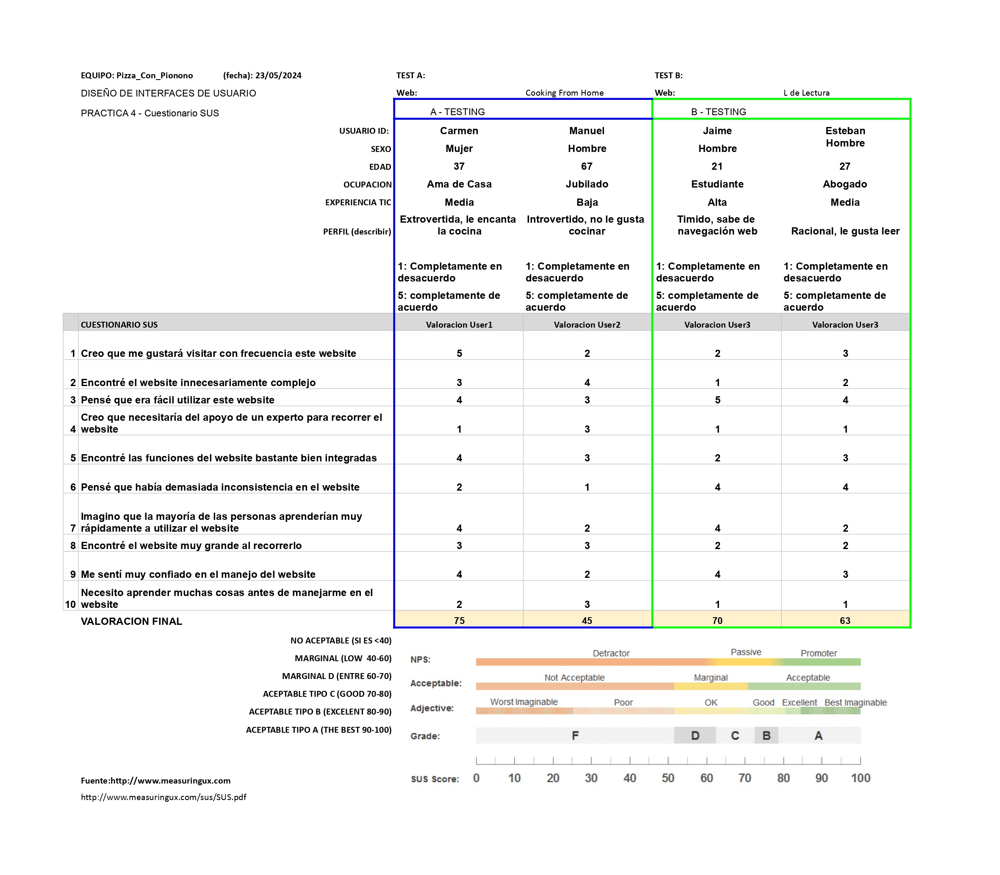

# DIU24
Prácticas Diseño Interfaces de Usuario 2023-24 (Tema: Experiencias gastronómicas) 

### Repositorio GitHub: https://github.com/AlvareitorHD/DIU2.git

Grupo: DIU2_PizzaConPionono.  Curso: 2023/24 
Updated: 24/04/2024

Proyecto: Cooking From Home

Descripción: 
Nuestra plataforma ofrece una experiencia única para todos los entusiastas de la cocina que desean llevar sus habilidades culinarias al siguiente nivel. Con una amplia variedad de cursos de cocina en línea, te invitamos a descubrir una nueva forma de acceder a recetas exclusivas y aprender de los mejores chefs de toda España, todo desde la comodidad de tu hogar.

Propuesta de Valor:
Con nuestra plataforma de cursos de cocina en línea descubrirás una nueva forma de acceder a recetas exclusivas. Tendrás la posibilidad de dominar nuevas habilidades culinarias y aprender de los mejores chefs de toda España, y todo desde el confort de tu hogar. Únete ahora y comienza a crear platos extraordinarios.

Logotipo:

Miembros
 * :bust_in_silhouette:   Álvaro Ruiz Luzón     :octocat:     
 * :bust_in_silhouette:  Adrián Romero Vílchez     :octocat:

----- 

# Proceso de Diseño 

## Paso 1. UX Desk Research & Analisis 

 **1.a User Research Plan**
-----

El proyecto se centra en un centro de formación que ofrece cursos y talleres de cocina para particulares y profesionales del sector de la hostelería. El objetivo de la investigación es adquirir conocimientos para mejorar el diseño y desarrollo de la plataforma en el ámbito de la gastronomía.

Los objetivos del negocio y KPIs incluyen comprender al usuario, evaluar la facilidad de uso de la plataforma, aumentar la participación de los usuarios en actividades gastronómicas y mejorar la diversidad y calidad de las actividades ofrecidas.

Se recopilará información cualitativa y cuantitativa a través de pruebas de usabilidad, entrevistas de experiencia, encuestas de expectativas, datos de uso, encuestas de satisfacción y perfiles de usuarios. Los documentos y artefactos a crear incluyen un informe de investigación, tablas y gráficos, mapas de empatía y storyboards de experiencia del usuario.

Los insights obtenidos de la investigación guiarán decisiones como el desarrollo de características y funcionalidades, la optimización de la experiencia del usuario, la personalización del contenido y la comunicación, la mejora de la calidad y variedad de actividades, y la optimización de estrategias de marketing y comunicación.

Los métodos de investigación incluirán entrevistas con participantes potenciales, estudios etnográficos, pruebas de usabilidad, encuestas de satisfacción y análisis de comentarios de usuarios.

Se estudiarán temas como la utilidad, aprendizaje, eficiencia, memorabilidad, errores, satisfacción y persuasión del diseño de la plataforma. Se enfocará en la claridad, simplicidad, navegabilidad y atractivo visual de la plataforma.

Como stakeholder, se ha tenido experiencia participando en actividades gastronómicas similares, lo que brinda una perspectiva valiosa sobre las necesidades y preferencias de los usuarios. Como diseñador, se cuenta con habilidades para desarrollar un diseño cómodo y atractivo para los usuarios.

Como conclusión, este User Research profundiza en las necesidades y comportamientos de los usuarios en experiencias gastronómicas, ofreciendo insights valiosos para mejorar el diseño, desarrollo y estrategias de marketing de la plataforma. Con un enfoque en la satisfacción del usuario, este estudio es fundamental para el éxito competitivo en el mercado culinario.

[User Research PDF](./P1/User_Research.pdf)

 1.b Competitive Analysis
-----

Hemos seleccionado tres aplicaciones para realizar el Competitive Analysis:

- **Granada Cooking**: Ofrece talleres de cocina en Granada con un precio medio de 50€ por taller. Es simple y fácil de reservar actividades, lo que lo hace adecuado para casi cualquier usuario de Granada.

- **Espai Granada**: Un loft vanguardista ideal para eventos, con un precio medio de 20€ por taller. Aunque es mejorable, ofrece servicios interesantes en un ático y tiene un enfoque más familiar.

- **Summumm**: Proporciona un programa completo para disfrutar individualmente o con empresas, con un precio medio de 85€ por taller. Cuenta con diversificaciones y estrategias de expansión, como cenas y asesoramiento además de los talleres.

Hemos elegido estudiar ***Summumm*** debido a la diversidad de servicios y estrategias de expansión que tienen, pueden atraer tanto a individuos como a empresas, ofreciendo una experiencia más completa y variada. Además, su enfoque profesional puede ajustarse a necesidades complejas, lo que le da una ventaja sobre los otros dos competidores.

[Competitive_Analysis PDF](./P1/Competitor_Analysis.pdf)

 1.c Persona
-----

Hemos seleccionado a estas personas porque representan grupos demográficos variados que nos ofrece perspectivas diversas.

Por un lado, tenemos una visión de una persona poco relacionada con la tecnología y no muy experimentada, María Antoñieta, que nos ayuda
a ver como pueden desenvolverse las personas mayores al usar nuestra plataforma. Maria Antoñieta es una señora mayor que quiere probar
nuevas experiencias y descubrir nuevos platos y sabores.

Por otro lado, tenemos a Li Yong, que tiene mucha más soltura con los ordenadores y el manejo de las tecnologías, lo que nos permite comprobar
si el diseño de nuestra plataforma le resultaría adecuado a gente joven y enérgica.

 1.d User Journey Map
----

Maria Antoñieta se encuentra planeando un viaje a Granada cuando le cuentan de nuestros cursos de cocina y se aventura a 
reservar un curso, sin tener mucha idea de como funciona nuestra plataforma. Li Yong quiere realizar algún curso de 
cocina occidental, pero debido a la dificultad del idioma no puede filtrar bien los talleres que desea realizar.

 1.e Usability Review
----

Proceso de evaluación de la página web Granada Cooking, donde comprobamos diferentes puntos y si debería de mejorarlos. En dicho estudio evaluamos diferentes apartados, como lo son la funcionalidad, la navegación la búsqueda o el rendimiento de la página.

La puntuación final es de 68-Moderada, lo que indica que los usuarios pueden completar la mayoría de las tareas importantes, aunque la experiencia podría modificarse considerablemente.

[Usability Review PDF](P1/Usability-review-Valoración%20Usabilidad.pdf)

Como valoración de la práctica, podemos concluir que los tiempos de carga son bastante largos, y la funcionalidad del calendario y las horas disponibles presentan fallos, que deben ser abordados para mejorar la eficacia de la página.

## Paso 2. UX Design  

 2.a Reframing / IDEACION: Feedback Capture Grid / Empathy map 
----

Hemos realizado un mapa de empatía de la plataforma Granada Cooking, donde sintetizamos los aspectos más destacados obtenidos por los usuarios (y por nuestra propia experiencia) de la práctica anterior, lo que nos permitirá abordar de una mejor manera el diseño de nuestra plataforma.

Gracias a este estudio, podemos plantearnos mejorar la funcionalidad del calendario y los horarios, entre otros.

 2.b ScopeCanvas
----

### Propuesta de valor

Con nuestra plataforma los usuarios descubrirán una nueva forma de acceder a recetas exclusivas, y tendrán la posibilidad de dominar nuevas técnicas culinarias y aprender de los mejores chefs de toda España. Por supuesto, todo esto desde el confort de su hogar.

Para complementar la propuesta de valor hemos creado un LeanUX Canvas

 2.b User Flow (task) analysis 
-----

>>> Definir "User Map" y "Task Flow" ... 

 2.c IA: Sitemap + Labelling 
----

>>> Identificar términos para diálogo con usuario  

Término | Significado     
| ------------- | -------
  Login¿?  | acceder a plataforma

 2.d Wireframes
-----

>>> Plantear el  diseño del layout para Web/movil (organización y simulación ) 

## Paso 3. Mi UX-Case Study (diseño)

 3.a Moodboard
-----

>>> Plantear Diseño visual con una guía de estilos visual (moodboard) 
>>> Incluir Logotipo
>>> Si diseña un logotipo, explique la herramienta utilizada y la resolución empleada. ¿Puede usar esta imagen como cabecera de Twitter, por ejemplo, o necesita otra?

  3.b Landing Page
----

>>> Plantear Landing Page 

 3.c Guidelines
----

>>> Estudio de Guidelines y Patrones IU a usar 
>>> Tras documentarse, muestre las deciones tomadas sobre Patrones IU a usar para la fase siguiente de prototipado. 

  3.d Mockup
----

>>> Layout: Mockup / prototipo HTML  (que permita simular tareas con estilo de IU seleccionado)

 3.e ¿My UX-Case Study?
-----

>>> Publicar my Case Study en Github..
>>> Documente y resuma el diseño de su producto

## Paso 4. Evaluación 

 
### 4.a Caso asignado

El caso asignado es la evaluación del proyecto <em>[L de Lectura](https://github.com/Duva-01/DIU.DTR)</em>. Se trata de una plataforma que te permite participar en clubes de lectura, donde puedes realizar lecturas de libros y realizar actividades. En el apartado de lecturas podemos encontrar cada uno de los libros disponibles, así como las valoraciones que poseen. En el apartado de actividades se encuentran las reuniones que se realizan para cada lectura de un libro, así como los comentarios de los asistentes.

### Historia del Caso Asignado

Nuestra misión era evaluar la usabilidad de la plataforma <em>L de Lectura</em>, que se enfoca en crear una comunidad de lectores apasionados que discuten y analizan libros. La plataforma permite a los usuarios acceder a una amplia biblioteca de títulos, leer reseñas, y participar en discusiones y actividades relacionadas con los libros.

Uno de los desafíos que enfrentamos fue entender cómo los diferentes usuarios interactúan con las distintas funcionalidades de la plataforma. Desde la navegación por la biblioteca hasta la participación en discusiones de clubes de lectura, necesitábamos una visión clara de la experiencia del usuario.

Para abordar esto, seleccionamos un grupo diverso de usuarios que realizarían tareas específicas en la plataforma, y luego evaluaríamos su experiencia utilizando métodos de testing de usabilidad y el cuestionario SUS.

 
### 4.b User Testing

| Usuarios | Sexo/Edad | Ocupación | Exp.TIC | Personalidad | Plataforma | TestA/B |
| -------- | --------- | --------- | ------- | ------------ | ---------- | ------- |
| Carmen   | M / 37    | Ama Casa  | Media   | Extrovertido | Móvil      | A       |
| Manuel   | H / 67    | Jubilado  | Baja    | Introvertido | Windows    | A       |
| Jaime    | H / 21    | Estudiante| Alta    | Tímido       | Linux      | B       |
| Esteban  | H / 27    | Abogado   | Media   | Racional     | Móvil      | B       |

#### Historia de los Usuarios

**Carmen**, una ama de casa de 37 años, es extrovertida y tiene un conocimiento medio en tecnología. Utiliza su móvil para acceder a la plataforma, disfrutando de la facilidad de acceder a recetas y cursos mientras participa activamente en chats.

**Manuel**, un jubilado de 67 años, con poca experiencia en tecnología, utiliza su ordenador con Windows para explorar la plataforma. Aunque introvertido, se interesa por los cursos ofrecidos y los valora como una oportunidad para aprender nuevas habilidades.

**Jaime**, un estudiante tímido de 21 años con alta experiencia en tecnología, utiliza Linux para acceder a la plataforma de clubes de lectura. Aunque reservado, valora la estructura clara y la facilidad de acceso a información sobre libros.

**Esteban**, un abogado racional de 27 años, utiliza su móvil para acceder a la plataforma. Aprecia la organización lógica y la claridad en la presentación de actividades y lecturas.

 
### 4.c Cuestionario SUS

>>> Usaremos el **Cuestionario SUS** para valorar la satisfacción de cada usuario con el diseño (A/B) realizado. Para ello usamos la [hoja de cálculo](https://github.com/mgea/DIU19/blob/master/Cuestionario%20SUS%20DIU.xlsx) para calcular resultados siguiendo las pautas para usar la escala SUS e interpretar los resultados. Para más información, consultar aquí sobre la [metodología SUS](https://cui.unige.ch/isi/icle-wiki/_media/ipm:test-suschapt.pdf).

### Resultados del Cuestionario SUS

Adjuntamos una captura de imagen con los resultados y una valoración personal de cada usuario:

### Valoración Personal

**Carmen** encontró la plataforma fácil de usar pero sugirió mejoras en la interacción del chat.

**Manuel** tuvo dificultades iniciales debido a su baja experiencia en tecnología, pero valoró positivamente la claridad de las instrucciones.

**Jaime** apreció la interfaz limpia y la facilidad de navegación, pero sugirió añadir más funcionalidades interactivas.

**Esteban** encontró la plataforma intuitiva y bien organizada, aunque mencionó que algunas funciones podrían ser más accesibles.

 
### 4.d Usability Report

El informe de usabilidad para la aplicación "L de Lectura" revela tanto aspectos positivos como áreas de mejora. La aplicación, diseñada para fomentar la lectura y el debate sobre libros, presenta una interfaz de usuario sencilla y una paleta de colores relajante, lo cual favorece la lectura. Sin embargo, un problema significativo es la barra de navegación, que permanece estática en una posición incómoda durante el desplazamiento, dificultando la visibilidad y la navegación de los usuarios.

Los resultados de los tests de usabilidad, que involucraron a usuarios de diferentes perfiles, resaltaron la necesidad de mejorar la intuición y accesibilidad de la plataforma, especialmente para aquellos con menos experiencia en tecnología. Las técnicas utilizadas, como los estudios de eyetracking y los cuestionarios SUS, fueron útiles para identificar estas deficiencias y proponer soluciones, como ajustar la posición de la barra de navegación y simplificar la interfaz, lo cual se espera que mejore significativamente la experiencia del usuario.

### Valoración Personal

El análisis de usabilidad de la aplicación "L de Lectura" reveló tanto puntos favorables como áreas de oportunidad. Mientras que la interfaz simple y la paleta de colores relajante promueven una experiencia de lectura agradable, la barra de navegación estática resulta incómoda al desplazarse, afectando la experiencia del usuario. Los métodos de evaluación, incluyendo el eyetracking y los cuestionarios SUS, fueron efectivos para identificar problemas y proponer soluciones, como ajustar la ubicación de la barra de navegación y simplificar la interfaz, con el fin de mejorar la experiencia general del usuario en la plataforma.

# Conclusión final / Valoración de las prácticas

El proceso de desarrollo de diseño siguiendo la metodología UX ha sido una experiencia enriquecedora y reveladora. A lo largo de las prácticas, hemos podido aplicar diversas técnicas y herramientas que nos han permitido comprender mejor las necesidades y comportamientos de nuestros usuarios. Desde la investigación inicial hasta las evaluaciones de usabilidad, cada etapa ha contribuido a mejorar y refinar nuestra plataforma "Cooking From Home".

La valoración general del proceso es muy positiva. Hemos logrado identificar y abordar puntos críticos que afectan la experiencia del usuario, lo que ha resultado en una interfaz más intuitiva y accesible. Las técnicas como el uso de cuestionarios SUS y los estudios de eyetracking han sido especialmente útiles para obtener insights profundos y accionables.

El resultado final es una plataforma que no solo cumple con los objetivos de negocio, sino que también ofrece una experiencia de usuario óptima, lo que esperamos se traduzca en una mayor satisfacción y participación de nuestros usuarios. En resumen, estas prácticas han demostrado ser fundamentales para el desarrollo de un producto competitivo y centrado en el usuario.
